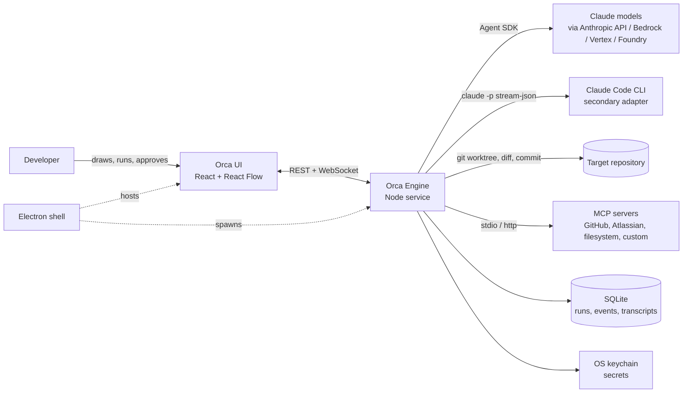
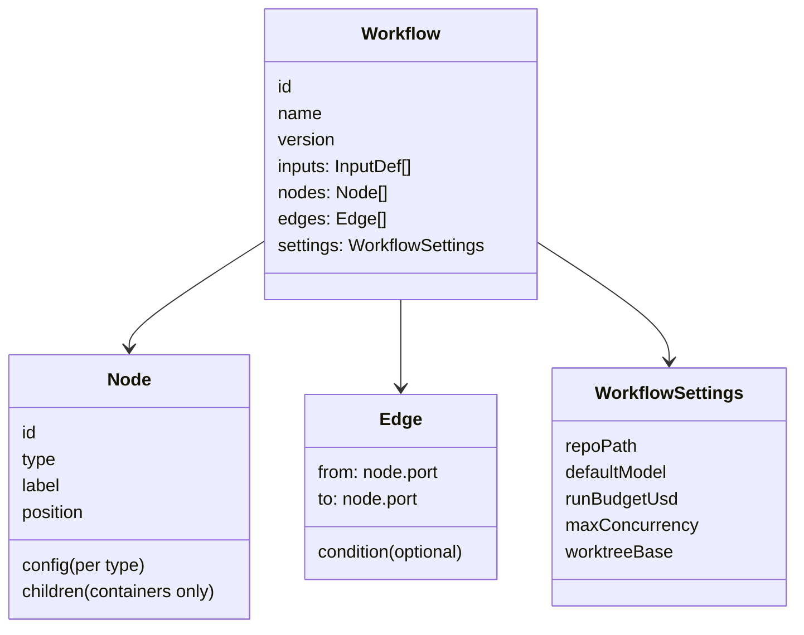
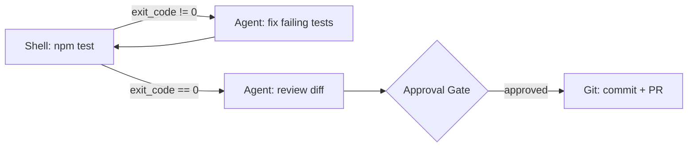
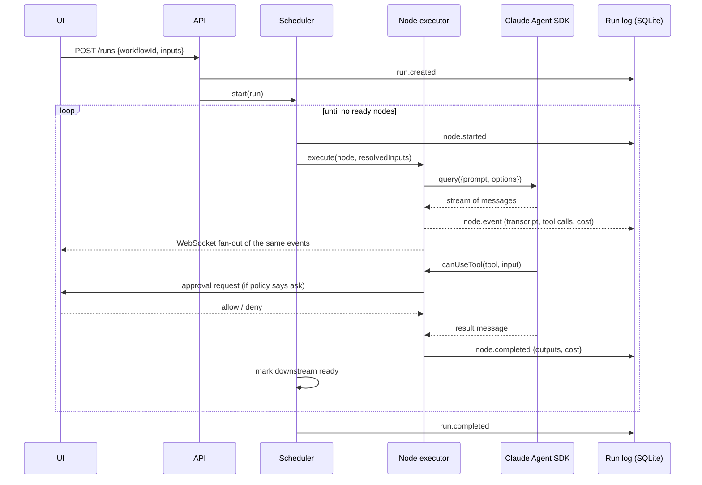
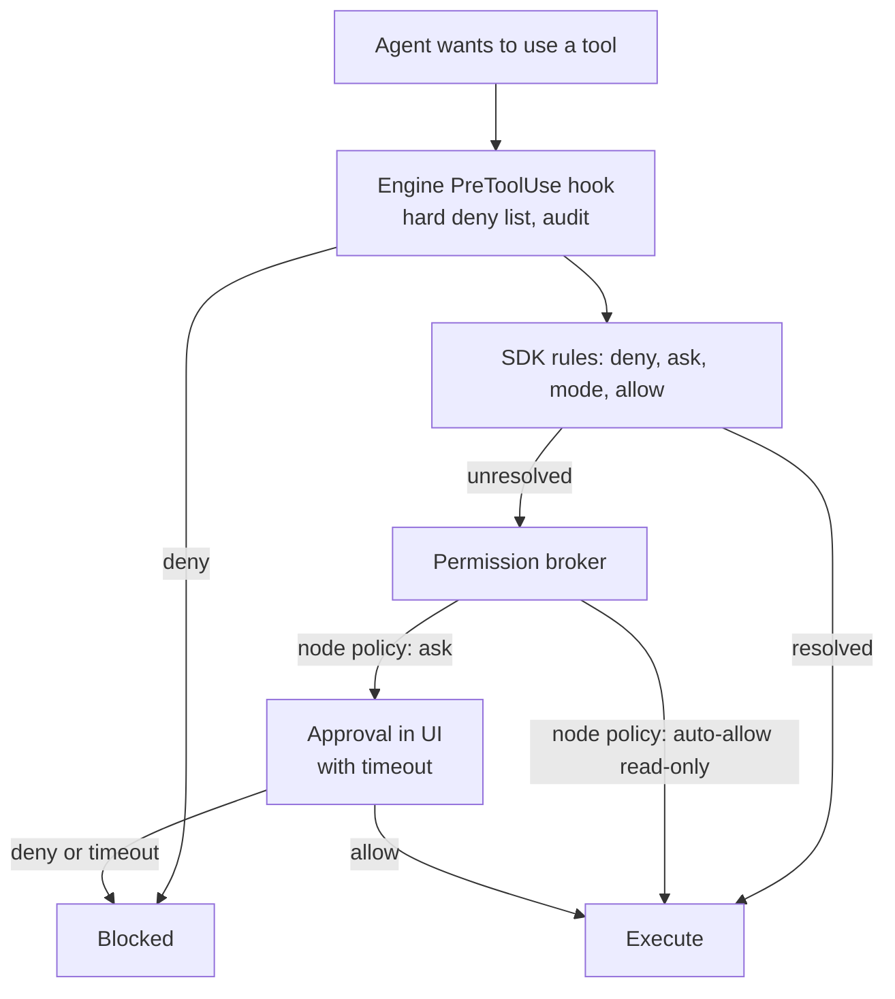
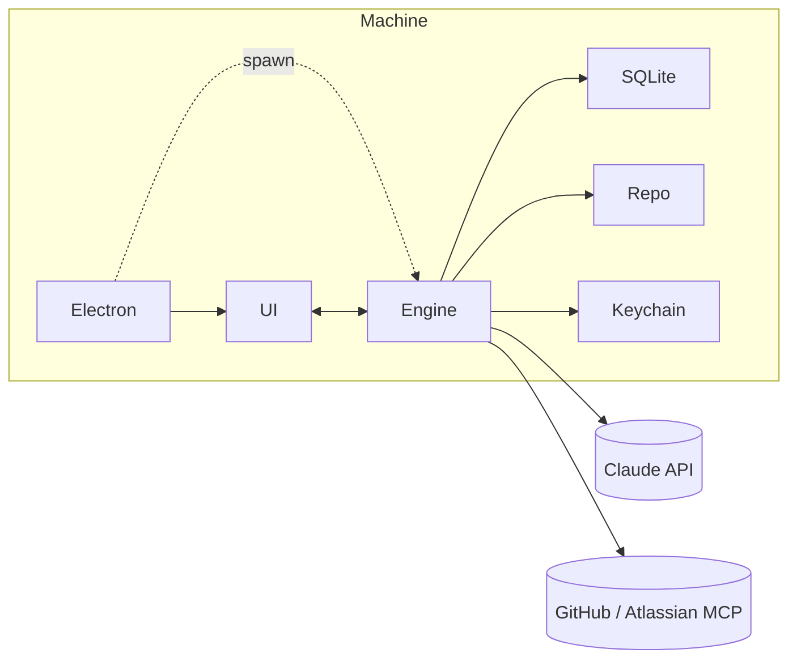
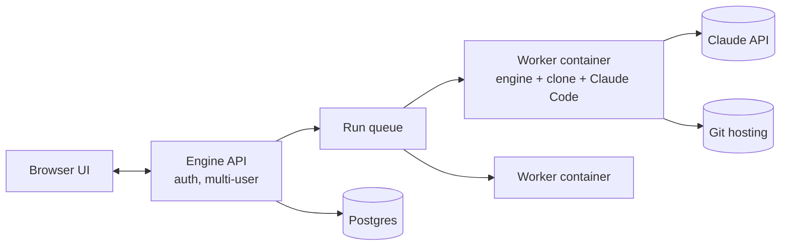

# Orca Architecture

Human-readable architecture document
Date: 2026-09-10
Audience: the product owner and any engineer who needs to understand how Orca is built without reading the technical spec.

---

## 1. Design principles

1. **The node is a whole agent, not a model call.** An Agent node has files, a shell, git, MCP servers, skills, and subagents. That is what makes Orca a developer tool rather than a prompt-chaining tool.
2. **Determinism lives in the graph; judgment lives in the nodes.** The canvas decides what runs next. Agents decide how to do a step. This is the same split Claude Code's dynamic workflows and Anthropic's "you own the loop, agents do the thinking" guidance arrive at.
3. **Every run is durable and inspectable.** Each node's inputs, outputs, transcript, cost, and diff are recorded. A run can pause at a gate for a day, survive an app restart, and resume.
4. **Nothing leaves a worktree without a human or a test saying so.** Isolation by default for nodes that write; explicit Gate or passing test before merge or PR.
5. **Local-first, repo-stored, deploy-ready.** Definitions are files in the repository. The engine is a headless service that happens to run on localhost today.
6. **Budgets are configuration, not hope.** Turn caps, dollar caps, iteration caps, and concurrency caps exist at node, loop, and run level with sane defaults.

## 2. System context

The desktop shell is deliberately thin. Everything that matters happens in the engine, and the UI only ever talks to the engine's API. That is what keeps the path to a deployed version open.

## 3. Components

### 3.1 UI (`packages/ui`)

A React single-page app built on React Flow.

- **Canvas**: nodes, typed ports, edges, groups (Loop and Map are container nodes that hold a subgraph), minimap, auto-layout, multi-select, copy/paste, undo/redo.
- **Palette**: the node catalog, searchable, with templates.
- **Inspector**: schema-driven form for the selected node. Prompt fields are code editors with template-variable autocompletion drawn from upstream node outputs.
- **Run view**: the same canvas with status badges, cost, and timers per node; click a node to open its transcript, tool calls, inputs, outputs, and diff.
- **Approvals**: a queue of pending gates and permission prompts, with the context needed to decide (plan text, diff, command about to run).
- **Run history**: list of runs per workflow, filterable, resumable.
- **Settings**: secrets (names only; values go to the keychain), MCP presets, default models, budgets.

State management: Zustand stores for the editor document and for live run state; React Query for server data.

### 3.2 Engine (`packages/engine`)

A Node service. Components inside it:

| Component | Responsibility |
|---|---|
| API | REST for CRUD and control, WebSocket for event streaming. Token-authenticated even on localhost. |
| Workflow store | Reads and writes `.orca/workflows/*.workflow.json` in the target repo; validates against the schema; computes a content hash. |
| Compiler | Turns a workflow document into an execution plan: resolves ports, checks types, expands containers, detects illegal cycles, precomputes readiness dependencies. |
| Scheduler | Drives a run: picks ready nodes, respects concurrency, handles Loop iterations and Map fan-out, waits on gates, applies retries, cancels. |
| Node executors | One per node type. Agent executors delegate to an agent adapter. |
| Expression engine | Evaluates `{{ }}` templates and condition expressions in a sandboxed JavaScript interpreter with a frozen context. |
| Run log | Event-sourced append-only log in SQLite. Run state is a projection of events. Node outputs are memoized by (run, node, scope). |
| Worktree manager | Creates, locks, diffs, merges, and removes git worktrees under `.orca/worktrees/`. |
| Agent adapters | `CopilotAdapter` (GitHub Copilot SDK, primary for v1), `ClaudeSdkAdapter` (Claude Agent SDK, needs an Anthropic key), `ClaudeCliAdapter` behind one interface; later Codex, Gemini, Aider. |
| Permission broker | Receives `canUseTool` calls and hook events from agents, applies node policy, and forwards what remains to the UI as approval requests with timeouts. |
| Secrets | Named secrets stored in the OS keychain (desktop) or an encrypted file (headless); substituted into MCP headers and env at launch, never into transcripts. |
| Triggers | Manual and schedule (cron) in v1; webhook and repository events in v2. |

### 3.3 Desktop shell (`packages/desktop`)

Electron. Spawns the engine as a child process with a random auth token, loads the UI, exposes the keychain (`safeStorage`), native file dialogs, notifications, and single-instance behavior. No business logic.

### 3.4 CLI (`packages/cli`)

`orca validate`, `orca run <workflow> [--input k=v]`, `orca resume <runId>`, `orca export`. Uses the same engine library in-process. This is how workflows run in CI.

### 3.5 Shared (`packages/shared`)

Zod schemas for the workflow document, node configs, run events, and API payloads. Both UI and engine import from here so they cannot drift.

## 4. The workflow model

### 4.1 Document

A workflow is a JSON document: metadata, inputs, nodes, edges, and settings. Nodes have a type, a config (validated per type), and a position. Edges connect an output port on one node to an input port on another. Container nodes (Loop, Map) own a child subgraph.

### 4.2 Node catalog (v1)

| Category | Node | What it does | Key outputs |
|---|---|---|---|
| Trigger | Manual | Starts a run with user-supplied inputs | `inputs` |
| Trigger | Schedule | Cron-based start | `firedAt` |
| Agent | Claude Agent | Runs a Claude Agent SDK session with a templated prompt, tools, MCP, skills, subagents, budgets, optional JSON schema | `text`, `json`, `files_changed`, `cost`, `session_id` |
| Agent | Judge | A Claude Agent preset that must return JSON matching a schema; used for routing and scoring | `json`, `score`, `verdict` |
| Action | Shell | Runs a command in the node's working directory with timeout | `exit_code`, `stdout`, `stderr` |
| Action | Git | Worktree create/remove, branch, commit, push, open PR (via `gh` or GitHub MCP) | `branch`, `commit`, `pr_url`, `diff` |
| Action | MCP Tool | Calls one MCP tool deterministically with templated arguments, no model | `result` |
| Action | Notify | Desktop notification, webhook, or Slack message | `delivered` |
| Control | Condition | Routes to `true` or `false` based on an expression | `true`, `false` |
| Control | Loop | Container; runs its body until an expression is true or max iterations reached; exposes the previous iteration's outputs | `last`, `iterations` |
| Control | Map | Container; runs its body once per item with a concurrency limit; optionally in a worktree per item | `results[]` |
| Control | Join | Waits for all incoming branches and merges their payloads | `merged` |
| Control | Approval Gate | Pauses the run until a human approves, rejects, or edits a payload | `approved`, `rejected`, `payload` |
| Data | Transform | Sandboxed JavaScript function over inputs | `value` |
| Composition | Sub-workflow | Runs another workflow as a node | its declared outputs |

### 4.3 Data flow

Outputs are JSON. A downstream node references them with template expressions such as `{{ nodes.plan.json.files }}` or `{{ item.path }}` inside a Map. The expression engine is a sandboxed JavaScript interpreter with a frozen context (`inputs`, `nodes`, `item`, `iteration`, `run`, `env`), a CPU time limit, and no I/O. Secrets are never in that context; they are substituted by the engine into MCP headers and process environment only.

### 4.4 Loops

A Loop is a container node with a body subgraph and an exit rule: an expression over the body's outputs, a maximum iteration count (required), and an optional budget. Each iteration sees `iteration.index` and `iteration.previous`. This is the explicit form of the "fix until green" pattern:

Internally the cycle above is represented as a Loop container around Shell and Agent with the rule `until: nodes.test.exit_code == 0, max: 5`, so the engine never executes an unbounded cycle.

## 5. Execution model

### 5.1 A run, step by step

### 5.2 Durability

The run log is append-only. Run state (which nodes are done, their outputs, what is waiting) is a projection of the log and can be rebuilt at any time. When the engine restarts:

1. It loads each run that was `running` or `waiting`.
2. Replays the log to rebuild state.
3. Nodes that completed return their memoized outputs and are not re-executed.
4. Nodes that were in flight are restarted (an in-flight agent session cannot be resumed mid-turn reliably, but the SDK's `resume` lets a restarted node continue its own conversation where a transcript exists).
5. Gates that were waiting keep waiting.

This mirrors the resume semantics of Claude Code's workflow runtime and of Inngest: completed steps are cached, interrupted steps re-run.

### 5.3 Replay from node

A developer can change one node's prompt and replay from there. Everything upstream is served from the memoized log; the changed node and everything downstream re-run. This is the canvas equivalent of LangGraph time travel.

### 5.4 Concurrency and budgets

| Level | Control | Default |
|---|---|---|
| Node (agent) | `maxTurns`, `maxBudgetUsd`, wall-clock timeout | 50 turns, 5 USD, 30 minutes |
| Loop | max iterations, optional budget | required, suggest 3 to 5 |
| Map | concurrency | 4 |
| Run | total budget, max concurrent agent sessions | 25 USD, 4 |
| Engine | global concurrent agent sessions | 8 |

The SDK enforces its own caps inside a session (including subagent spend). The engine enforces the aggregates and stops dispatching when a run's budget is exhausted.

## 6. The Agent node in depth

The Agent node is a thin, declarative wrapper over the Claude Agent SDK's `query()` call. Its configuration maps almost one-to-one onto SDK options:

| Node setting | SDK option | Notes |
|---|---|---|
| Prompt (template) | `prompt` | Rendered with upstream outputs before the call |
| Instructions | `systemPrompt` (preset `claude_code` plus append, or custom) | Preset keeps Claude Code's built-in behavior |
| Load project context | `settingSources: ['project']` | Brings in `CLAUDE.md`, `.claude/agents`, skills, `.mcp.json` |
| Model, effort | `model`, `effort` | Defaults: `claude-opus-5`, `high`; Judge defaults to `claude-sonnet-5` |
| Tools | `allowedTools`, `disallowedTools` | Scoped rules such as `Bash(npm *)` supported |
| Permission mode | `permissionMode` | `default`, `acceptEdits`, `plan`, `dontAsk`, `auto`, `bypassPermissions` |
| Approval routing | `canUseTool` | Engine policy first, then UI prompt with timeout |
| Guardrails | `hooks` (`PreToolUse`, `PostToolUse`, `Stop`) | Deny patterns, audit log, output capture |
| MCP servers | `mcpServers` | stdio, SSE, HTTP, in-process |
| Subagents | `agents` | Editable `AgentDefinition`s with their own tools, model, effort |
| Structured output | `outputFormat: { type: 'json_schema', schema }` | Feeds `json` output port |
| Budgets | `maxTurns`, `maxBudgetUsd` | Required |
| Working directory | `cwd` | The node's worktree or the repo root |
| Continue previous | `resume`, `forkSession` | For multi-step conversations across nodes |
| Undo | `enableFileCheckpointing` + `rewindFiles()` | For non-worktree nodes |
| Plugins | `plugins` | Local plugin paths |

What comes back is the SDK's message stream. The engine records assistant messages, tool uses and results, subagent activity (`parent_tool_use_id`), cost (`total_cost_usd`, `modelUsage`), and the final `result` with its `subtype` (`success`, `error_max_turns`, `error_max_budget_usd`, and so on). Those become the node's outputs and its transcript.

### 6.1 Permissions: who decides

Three layers, each narrower than the last: engine-wide hard denies (for example `rm -rf /`, writes outside the worktree), the SDK's own evaluation order, and finally the human. Nodes in `dontAsk` mode never reach the human; anything unresolved is denied, which is the right setting for unattended scheduled runs.

### 6.2 Isolation

For a node with isolation on, the engine creates a git worktree under `<repo>/.orca/worktrees/<runId>/<nodeId>` on a fresh branch and passes it as `cwd`. The Claude Code runtime itself blocks edits and git commands that target the main checkout from inside a worktree. When the node finishes, the diff is captured into the run log and shown in the UI. A Git node or a Gate decides whether to commit, merge, open a PR, or discard. Worktrees are locked while in use and swept after the run's retention period.

### 6.3 The Copilot runtime (v1 primary)

The owner's organization uses GitHub Copilot, so the first adapter is the GitHub Copilot SDK. It embeds the Copilot CLI in server mode and authenticates with the developer's GitHub identity (the `copilot login` or `gh auth` OAuth token), so runs consume the org's Copilot seats and obey its policies for models and MCP. The mapping is close to the Claude table above: `createSession` takes the model, system message, MCP servers, custom agents, and tools; `onPermissionRequest` plays the role of `canUseTool` with kinds `shell`, `write`, `read`, `mcp`, `custom-tool`, and `url`; `onPreToolUse` and friends are the hooks. Differences Orca absorbs: cost is counted in premium requests rather than dollars, there is no structured-output option (Judge nodes use a `submit_result` tool), and worktrees are managed entirely by Orca. For a deployed Orca, a GitHub App with the Copilot Requests permission provides organization-billed, seat-less authentication.

## 7. Integrations

| Integration | Mechanism | v1 status |
|---|---|---|
| GitHub | Official remote MCP server over HTTP with a personal access token in headers; `gh` CLI for PR creation in the Git node | Preset |
| Jira, Confluence, Bitbucket | Official Atlassian remote MCP server (OAuth 2.1). The SDK does not run browser OAuth flows, so v1 launches the server through a stdio OAuth bridge process; v2 performs PKCE natively and stores tokens in the keychain | Preset via bridge |
| Filesystem, Playwright, databases | Standard stdio MCP servers | Generic config |
| Anything else | Any stdio or HTTP MCP server configured per node or per workflow | Generic config |
| Skills and instructions | The node opts into the project's `.claude/` directory; the UI can also attach inline instructions and plugin paths | Yes |

## 8. Security and safety model

- Secrets never enter workflow files, the expression context, prompts, or logs. They are resolved at process launch into MCP headers and environment.
- Default permission mode for writer agents is `acceptEdits` inside a worktree; `bypassPermissions` is allowed only when the node is isolated and the workflow is marked unattended.
- Engine hard-deny hooks block destructive shell patterns and paths outside the worktree regardless of mode.
- The engine API requires a bearer token even on localhost; the desktop shell generates it per launch.
- Transcripts may contain repository content; they are stored locally and excluded from any future telemetry.
- Subagent output is scanned by Claude Code for instruction-shaped patterns before the parent reads it, which reduces prompt-injection risk from files and web content.

## 9. Deployment topologies

**v1 desktop (local)**

**v2 deployed (team)**

The only changes between the two are the storage adapter (SQLite to Postgres), the session store for resuming agent transcripts across hosts (the SDK supports a pluggable `sessionStore`), and where worktrees live (a fresh clone per worker instead of a local worktree).

## 10. Technology choices and rationale

| Choice | Alternatives considered | Why |
|---|---|---|
| TypeScript everywhere | Python engine | The Agent SDK is TypeScript-first with the broadest surface; one language across UI, engine, and shell |
| React Flow (xyflow) | Rete.js, custom canvas | Used by Langflow, Flowise, and Sim; handles selection, zoom, edges, and custom nodes well |
| Electron | Tauri | Tauri is lighter, but the engine is Node anyway; Electron avoids a Rust build and a sidecar protocol. Revisit if bundle size matters |
| Node service behind REST and WebSocket, even on desktop | In-process engine in Electron main | Crash isolation, identical code path for the deployed version, CLI reuse |
| SQLite (better-sqlite3) with an event-sourced log | JSON files, LevelDB | Transactions, queryable history, trivially portable to Postgres later |
| Sandboxed JavaScript (QuickJS in WebAssembly) for expressions | JSONata, JMESPath, Node `vm` | Matches the JavaScript that Claude Code workflows use, is safe, and supports real logic in Transform nodes |
| Claude Agent SDK as primary adapter | Raw Anthropic API with a hand-rolled tool loop | The SDK is the whole coding agent: tools, context management, permissions, subagents, sessions. Rebuilding it is months of work |
| Claude Code CLI as secondary adapter | None | Lets users run under their own Claude Code install and entitlements; also a fallback when the SDK lags a CLI feature |
| git worktrees | Full clones, copy-on-write snapshots | Cheap, shared history, proven by every coding orchestrator, enforced by Claude Code itself |

## 11. Roadmap

| Milestone | Delivers | Demonstrable outcome |
|---|---|---|
| M1 Canvas and deterministic engine | Schema, canvas, inspector, Shell, Condition, Loop, Transform, Join, manual runs, run log | A "run tests, loop until green with a fake fixer" workflow runs, pauses, resumes |
| M2 Claude Agent node | SDK adapter, streaming transcript, permission broker, budgets, structured output, Judge | "Fix until green" with a real agent |
| M3 Isolation and review | Worktree manager, Git node, diff viewer, Approval Gate, notifications | "Issue to PR" with two human gates |
| M4 Scale-out and integrations | Map, Join, MCP presets (GitHub, Atlassian), secrets, Sub-workflow | "Parallel review" and "Tournament" |
| M5 Hardening and release | Crash resume, replay-from-node, schedule trigger, CLI, installers | Nightly hygiene runs unattended; installers for Windows, macOS, Linux |
| v2 | Webhooks, more adapters, native OAuth, export to Claude workflow scripts, evaluation harness, headless deployment | Team use |

## 12. Glossary

- **Agent node**: a canvas node that runs one Claude Agent SDK session.
- **Adapter**: engine code that drives a particular agent runtime (SDK, CLI).
- **Gate**: a node that pauses a run until a person decides.
- **Memoized output**: a node's recorded result, reused on resume or replay.
- **Run**: one execution of a workflow; a sequence of events in the run log.
- **Scope**: the position of a node execution inside containers (for example Map item 3, Loop iteration 2).
- **Worktree**: a separate git working directory sharing the repository's history, used to isolate an agent's edits.
