# Orca user guide

Orca is a visual orchestrator for coding agents. You draw a workflow on a canvas, where each node is either a full GitHub Copilot agent session or a deterministic step (a shell command, a condition, a loop, an approval gate, a git operation, an MCP tool call), and Orca runs it as a durable, reviewable run. Workflow definitions are plain JSON files that live in your repository under `.orca/workflows/`.

This guide starts with installation and a tour of the UI, then walks through six use cases in increasing order of complexity. Each one introduces the features it needs. A reference section at the end lists every node type, the expression language, permission rules, settings, and the CLI.

Contents

1. [Setup and sign-in](#1-setup-and-sign-in)
2. [A tour of the UI](#2-a-tour-of-the-ui)
3. [Use case 1: Hello Orca (no agents)](#3-use-case-1-hello-orca-no-agents)
4. [Use case 2: Fix until green (an agent in a loop)](#4-use-case-2-fix-until-green-an-agent-in-a-loop)
5. [Use case 3: Issue to PR (isolation, review, gates, git)](#5-use-case-3-issue-to-pr-isolation-review-gates-git)
6. [Use case 4: Parallel review (fan-out with Map)](#6-use-case-4-parallel-review-fan-out-with-map)
7. [Use case 5: Tournament (per-item worktrees and a judge)](#7-use-case-5-tournament-per-item-worktrees-and-a-judge)
8. [Use case 6: MCP servers and secrets](#8-use-case-6-mcp-servers-and-secrets)
9. [Everything else: join, sub-workflows, guards, retries, resume, CLI](#9-everything-else)
10. [Reference](#10-reference)
11. [Troubleshooting](#11-troubleshooting)

---

## 1. Setup and sign-in

### Prerequisites

| Requirement | Why |
|---|---|
| Node.js 22 or newer (24 tested) | The engine uses `node:sqlite` and native WebSockets. |
| pnpm 9+ | Monorepo package manager. |
| git 2.40+ | Worktree isolation, diffs, commits. |
| GitHub CLI `gh` (signed in) | Only needed for the Git node's `pr.create` operation and `orca sample init --remote`. |
| A GitHub account with a Copilot seat | Agent nodes run through the GitHub Copilot SDK. |

### Install and sign in

```powershell
git clone https://github.com/EpoCo742/orca
cd orca
pnpm install
pnpm orca auth login      # opens the official Copilot CLI login: browser + GitHub 2FA
pnpm orca auth status     # should print the signed-in user
pnpm orca models          # lists the models your Copilot policy allows
```

`orca auth login` runs the official `copilot login` flow. It opens a browser page, asks you to authorize, and may require a GitHub Mobile or 2FA confirmation. The token is stored by the Copilot CLI, not by Orca. Orca never sees or stores your GitHub password.

### Start Orca

```powershell
pnpm dev
```

This starts the engine on `http://127.0.0.1:4111` with a random bearer token, starts the UI on `http://127.0.0.1:5173`, and opens the browser at a URL that carries both:

```
http://127.0.0.1:5173/#engine=http://127.0.0.1:4111&token=<token>
```

Keep that URL. If you open the UI without the hash, it cannot reach the engine. The token is printed in the terminal as `engine listening at ... token=...`.

Useful variants:

```powershell
pnpm orca dev --no-open          # do not open a browser
pnpm orca dev --no-copilot       # engine without Copilot; only fake agents run (for UI work)
pnpm orca engine --port 4111 --token mytoken   # engine only, fixed token (for CI or a second UI)
```

### Create a sample repository to practice on

The bundled templates target a tiny Node.js project with intentionally broken math functions. Make a standalone copy of it so agents can commit, push, and open pull requests without touching the Orca repository:

```powershell
pnpm orca sample init ../orca-sample-target                       # local git repo only
pnpm orca sample init ../orca-sample-target --remote you/orca-sample-target   # also creates a private GitHub repo and pushes
```

The Issue to PR and Tournament templates expect this repository at `../../orca-sample-target` relative to the templates folder (that is, a sibling of the Orca checkout). The Fix until green templates use the in-repo copy at `examples/sample-target`.

---

## 2. A tour of the UI

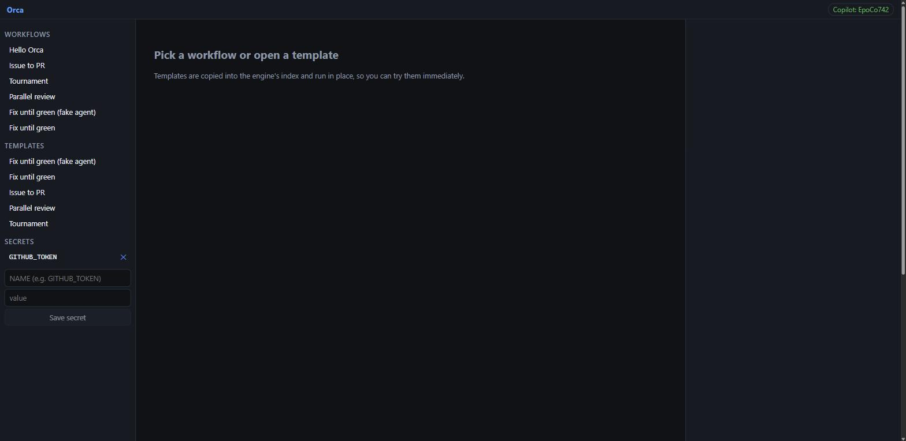

The window has four regions.

**Sidebar (left)**

- **Workflows**: every workflow the engine knows about. Clicking one opens it on the canvas.
- **Templates**: the bundled example workflows. Clicking one imports it into the engine's index in place (the template file itself is used), so you can run it immediately. Once imported it also appears under Workflows.
- **Runs**: run history for the open workflow, newest first, with status and premium-request cost. Click a run to open it in Run mode.
- **Secrets**: encrypted values that MCP server configs can reference as `${SECRET:NAME}` (see use case 6).
- **Nodes**: the palette. Drag a node onto the canvas in Edit mode. Grouped as Triggers, Agents, Actions, Control, Data.

**Top bar**

- **Edit / Run** toggles between editing the workflow and viewing a run. In Run mode the canvas is read-only and shows live status on each node.
- **Validate** compiles the workflow and lists problems (unknown references, missing worktree isolation, bad edges) without running.
- **Save** writes the JSON file back to disk. It is enabled only when there are unsaved changes.
- **Run** starts a run. If the workflow declares inputs, a dialog asks for them first.
- **Copilot: <user>** on the right shows the signed-in Copilot account, or a warning if the SDK is not authenticated.

**Canvas (centre)**

Nodes with typed ports. Every node has an implicit `Trigger` input and implicit `Done` and `Error` outputs; the other ports are specific to the node type. Edges connect an output port to an input port. Loop and Map nodes are containers: their body nodes sit inside their box. Use the controls at the bottom-left of the canvas to zoom, fit the view, and lock the layout.

**Inspector (right)**

With nothing selected, the inspector shows the **workflow** settings: name, description, repository path, default model and effort, run budget, agent concurrency, worktree settings, MCP servers, and the current list of validation problems.

With a node selected in Edit mode, it shows that node's configuration. In Run mode it shows the node's status, outputs, transcript, and diff for that run.

---

## 3. Use case 1: Hello Orca (no agents)

The first workflow uses no model at all. It runs a git command, counts the lines, branches on a threshold, and shows a notification. It teaches the canvas, ports, expressions, templates, inputs, and the run view.

### The workflow file

Workflows are JSON. A sample repository created with `orca sample init` already contains this file at `.orca/workflows/hello.workflow.json`; if yours predates it, create it:

```json
{
  "schemaVersion": 1,
  "id": "d4e5f6a7-b8c9-4d0e-9f1a-2b3c4d5e6f08",
  "name": "Hello Orca",
  "description": "A first workflow with no agents: run a git command, compute a value, branch on it, notify.",
  "inputs": [
    { "name": "min_commits", "type": "number", "default": 2, "description": "How many commits count as 'active'" }
  ],
  "settings": {},
  "nodes": [
    { "id": "start",  "type": "trigger.manual",    "position": { "x": 40,   "y": 160 }, "config": { "inputsForm": ["min_commits"] } },
    { "id": "log",    "type": "action.shell",      "position": { "x": 260,  "y": 160 }, "config": { "command": "git log --oneline -10" } },
    { "id": "count",  "type": "data.transform",    "position": { "x": 500,  "y": 160 }, "config": { "code": "return orca.lines(ctx.nodes.log.stdout).length" } },
    { "id": "active", "type": "control.condition", "position": { "x": 740,  "y": 160 }, "config": { "expression": "nodes.count.value >= inputs.min_commits" } },
    { "id": "yes",    "type": "action.notify",     "position": { "x": 1000, "y": 60 },  "config": { "title": "Active repository", "message": "{{ nodes.count.value }} recent commits (threshold {{ inputs.min_commits }})", "level": "success" } },
    { "id": "no",     "type": "action.notify",     "position": { "x": 1000, "y": 280 }, "config": { "title": "Quiet repository", "message": "Only {{ nodes.count.value }} commits", "level": "warning" } }
  ],
  "edges": [
    { "id": "e1", "from": { "node": "start",  "port": "done"  }, "to": { "node": "log",    "port": "trigger" } },
    { "id": "e2", "from": { "node": "log",    "port": "done"  }, "to": { "node": "count",  "port": "trigger" } },
    { "id": "e3", "from": { "node": "count",  "port": "done"  }, "to": { "node": "active", "port": "trigger" } },
    { "id": "e4", "from": { "node": "active", "port": "true"  }, "to": { "node": "yes",    "port": "trigger" } },
    { "id": "e5", "from": { "node": "active", "port": "false" }, "to": { "node": "no",     "port": "trigger" } }
  ],
  "ui": {}
}
```

Things to notice:

- `id` is a UUID and must be unique across workflows.
- `settings.repoPath` is omitted, so the repository is the one that contains the `.orca/workflows` folder. Shell commands run there.
- Inputs are declared once at the top and collected by the Manual trigger's `inputsForm`.
- The Transform node is JavaScript; it receives `ctx` and must `return` a value. The Condition node is a bare expression. Notify fields are templates with `{{ }}`.

### Registering the file with the engine

The UI has no "New workflow" button yet. Register a file with one API call (the token is the one printed by `pnpm dev`):

```powershell
curl -X POST http://127.0.0.1:4111/api/v1/workflows/import `
  -H "Authorization: Bearer <token>" -H "Content-Type: application/json" `
  -d '{"path":"C:/source/orca-sample-target/.orca/workflows/hello.workflow.json"}'
```

Reload the UI and **Hello Orca** appears under Workflows. Templates take a shortcut: clicking one in the sidebar imports it for you.

### The canvas

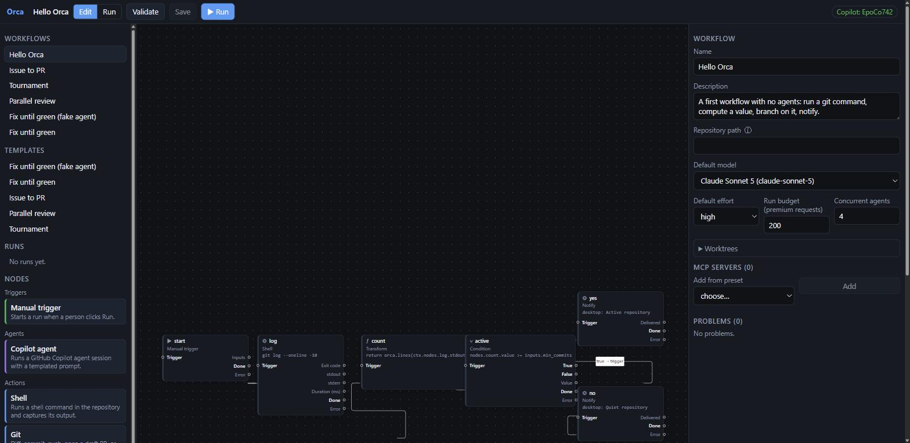

Each node shows its id, type, and a one-line summary of its configuration. Ports are labelled. The Condition node has `True` and `False` trigger outputs plus a `Value` data output. Edges from `True` and `False` decide which branch runs; the other branch is **skipped**, and skips cascade downstream.

### The inspector

Select the `log` node.

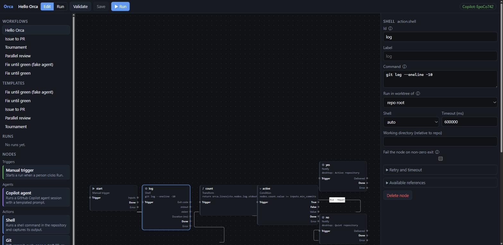

The Shell inspector has the command (a template, so `{{ }}` works), the shell to use (`auto` picks PowerShell on Windows and bash elsewhere), a working directory relative to the repo, an optional worktree to run in (use case 3), environment variables, a timeout, and whether a non-zero exit code should fail the node. By default a non-zero exit code does **not** fail the node; the `exit_code` output carries it so a Condition can branch on it. Every node also has a **Retry and timeout** section (max attempts, backoff, which failure kinds to retry, node timeout) and a **Disabled** checkbox.

Now select the `active` node and open **Available references**.

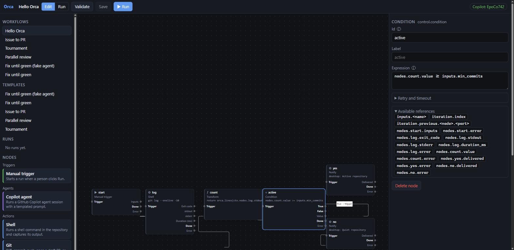

This list is generated from the nodes upstream of the selected node. It is the fastest way to learn the expression language: every entry is a valid reference, and clicking one copies it. Here you can see `nodes.log.stdout`, `nodes.count.value`, and `inputs.<name>`.

### Expressions and templates in one minute

- **Expressions** (Condition, Loop exit, Map items, Gate show items, edge guards) are JavaScript expressions evaluated in a sandbox. Context names: `inputs`, `nodes.<id>.<port>`, `item` and `index` inside a Map, `iteration.index` and `iteration.previous.<node>.<port>` inside a Loop, `run`, `env`.
- **Templates** (prompts, shell commands, notify text, git messages, MCP args) are strings where `{{ expr }}` is replaced by the expression's value. Objects are JSON-encoded.
- **Transform code** is a function body; the same names are reachable as `ctx.inputs`, `ctx.nodes`, and so on.
- Helpers: `orca.json(x)`, `orca.lines(s)`, `orca.truncate(s, n)`, `orca.tail(s, n)`.
- The sandbox is strict: referencing an output that does not exist is an error, values are frozen, and `Date.now` and `Math.random` are disabled so runs stay reproducible.

### Running it

Click **Run**. Because the workflow declares an input, the inputs dialog appears with the default filled in.

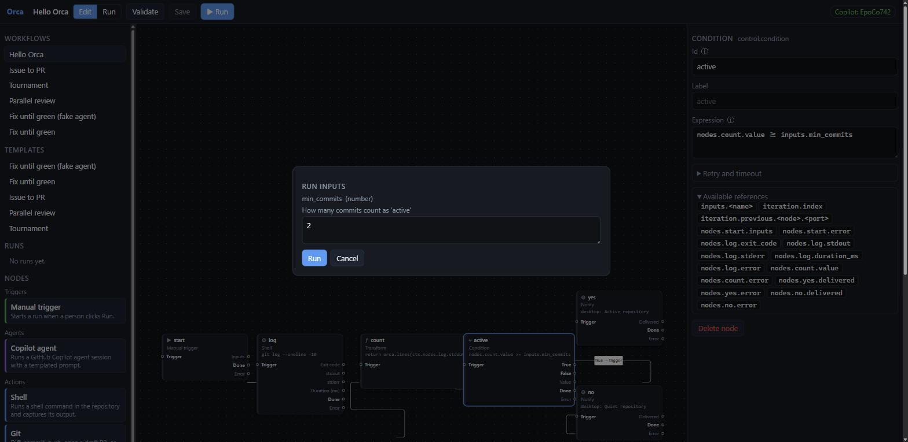

Click **Run** in the dialog. The UI switches to Run mode. Each node shows its status (`completed`, `running`, `skipped`, `failed`), completed nodes get a green border, the skipped branch is dimmed, and the Notify node raises a toast in the bottom-right corner. The run also appears under **Runs** with its status and cost (0 premium requests, since no agent ran).

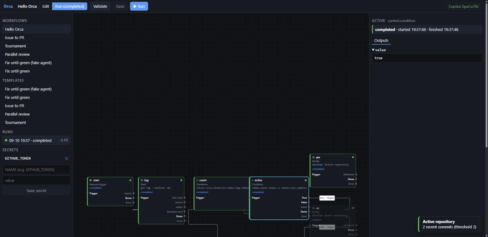

Click any node in Run mode to see what it produced. The `log` node's outputs are its exit code, stdout, stderr, and duration.

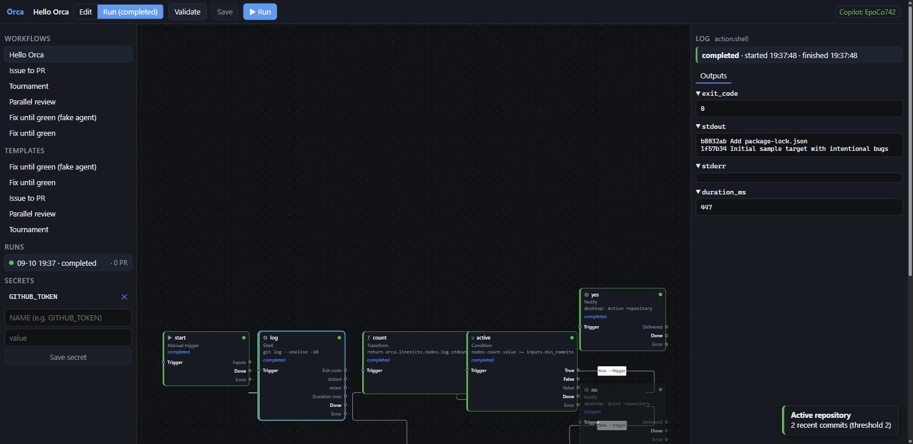

Try it again with `min_commits` set to 50 and watch the other branch run.

---

## 4. Use case 2: Fix until green (an agent in a loop)

Template: **Fix until green**. It runs the test suite; while it fails, a Copilot agent fixes the code; the loop exits when tests pass or after five iterations. This use case introduces the workflow settings, the Copilot agent node, the Loop container, transcripts, budgets, and tool-permission approvals.

Open it from **Templates > Fix until green**. (There is also **Fix until green (fake agent)**, which uses a scripted fake adapter; it is handy for learning the UI without spending Copilot requests.)

### Workflow settings

Click an empty part of the canvas to show the workflow inspector.

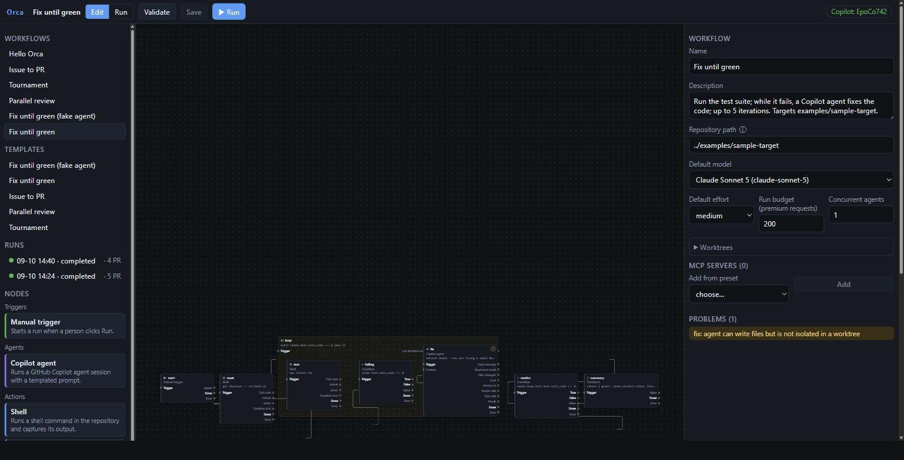

- **Repository path** is relative to the workflow file. The template points at `../examples/sample-target`.
- **Default model** and **Default effort** apply to every agent node that does not override them. The dropdown lists only the models your Copilot policy allows.
- **Run budget (premium requests)** stops the run if agents exceed it. **Concurrent agents** caps how many agent sessions run at once.
- **Worktrees** holds the base ref, the worktree directory, directories to link into each worktree (for example `node_modules`), and a setup command (use case 3).
- **MCP servers** is covered in use case 6.
- **Problems** lists validator findings. The warning here, "fix: agent can write files but is not isolated in a worktree", is intentional for this template: it edits the repository in place so you can see the loop in action. Use case 3 shows the isolated pattern.

### The agent node

Select the `fix` node inside the loop.

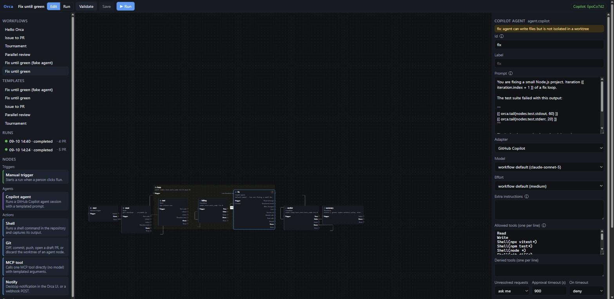

- **Prompt** is a template. This one includes `{{ iteration.index + 1 }}` and the tail of the test output, `{{ orca.tail(nodes.test.stdout, 60) }}`. Anything upstream can be referenced, so prompts can quote earlier agents' results, diffs, and inputs.
- **Adapter**: GitHub Copilot, or Fake for tests.
- **Model** and **Effort** default to the workflow's values.
- **Extra instructions** are appended to Orca's system prompt; you can also replace the system prompt entirely from the JSON (`system.mode = "custom"`).
- **Allowed tools** and **Denied tools** are permission rules, one per line. The forms are `Read`, `Write`, `Shell` (any command), `Shell(<glob>)`, `Mcp(<server>/<tool-glob>)`, and `Url(<glob>)`. Globs use `*`, are case-insensitive, and match the whole command. This node allows `Shell(npx vitest*)`, `Shell(npm test*)`, `Shell(node *)`, `Shell(git diff*)`, and a few read-only commands.
- **Unresolved requests**: what happens when the agent asks for something no rule covers. `ask me` creates an approval you decide in the UI; `deny` refuses silently. **Approval timeout** and **On timeout** decide what happens if nobody answers. **Auto-allow read-only tools** lets Copilot's own read-only classification through without asking.

Scroll down for the rest.

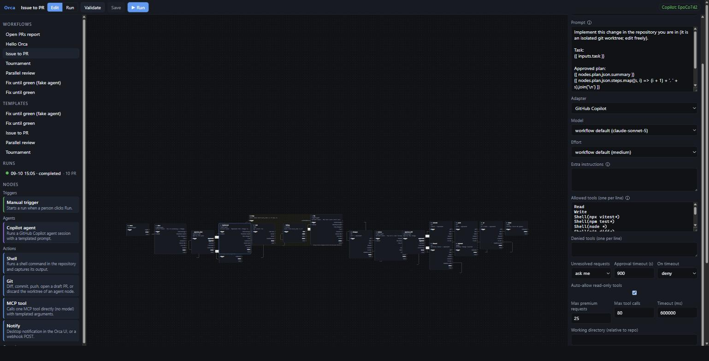

- **Max premium requests**, **Max tool calls**, and **Timeout** bound a single session. The Copilot SDK reports cost in premium requests; Orca counts them live and aborts the session when the cap is hit.
- **Working directory** is relative to the repo (or the worktree).
- **Isolation** and **Run in worktree of** are the worktree controls (use case 3).
- **Agent mode**: `interactive` (default), `plan` (explore and write a plan; no file edits), `autopilot`.
- **Structured result schema** turns the agent into a judge: when a JSON Schema is set, the agent receives a `submit_result` tool, the validated object appears on the `json` output port, and top-level `approve`, `score`, and `verdict` fields are lifted for easy branching (use case 3).

### The Loop container

Select the `loop` box.

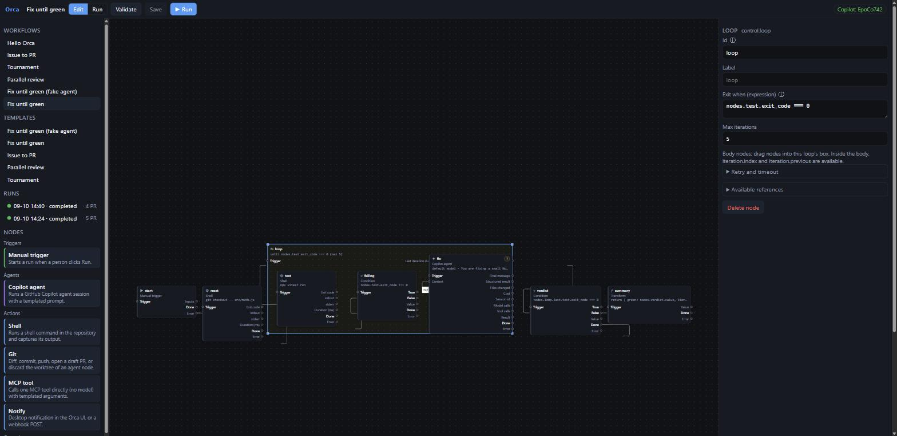

A Loop runs its body nodes (the ones drawn inside its box) repeatedly. **Exit when** is an expression evaluated after each iteration over the body's outputs; here `nodes.test.exit_code === 0`. **Max iterations** is the hard cap. Inside the body, `iteration.index` (0-based) and `iteration.previous.<node>.<port>` (the previous iteration's outputs) are available. After the loop finishes, downstream nodes read `nodes.loop.last.<node>.<port>`, `nodes.loop.iterations`, and `nodes.loop.exited_by` (`"until"` or `"max"`). To add nodes to a loop, drag them from the palette into the loop's box; to remove them, drag them out.

### Running it

Click **Run**. The loop's box shows the current iteration and each body node updates live. Agent nodes show their status, number of model calls, and tool calls as they happen. The fake variant finishes in seconds; the real one usually converges in one or two iterations and costs about four to five premium requests.

Select the `fix` node while the run is open. Because the node ran once per iteration, the inspector shows one tab per scope: `loop[0]`, `loop[1]`, and so on.

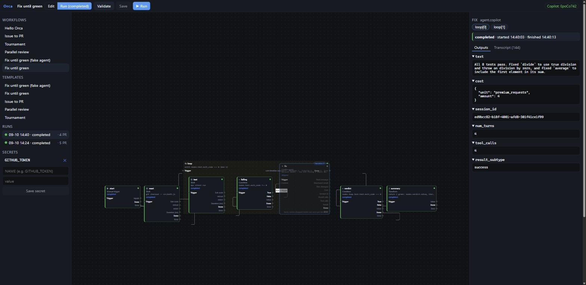

The **Outputs** tab shows the final message, the cost, the Copilot session id, the number of model turns and tool calls, and the result subtype. The **Transcript** tab shows the prompt as rendered, every tool call with its arguments and result, permission requests, and the assistant's messages. Tick **show all events** to include low-level SDK events.

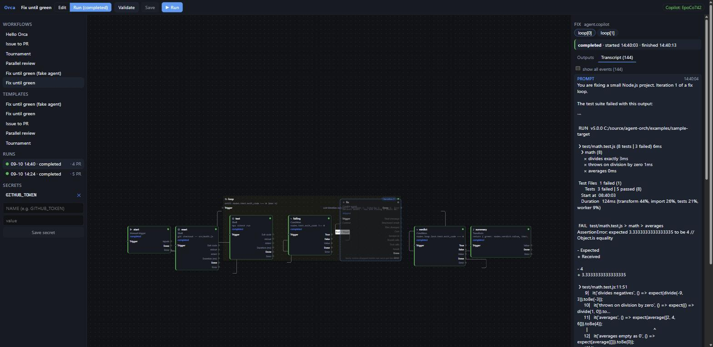

### Approvals

When an agent asks for a tool that no rule allows and the policy is `ask me`, the run pauses that agent and an approval card appears at the top of the sidebar. The top bar shows a badge with the number of waiting approvals, and the card is visible whichever workflow you have open.

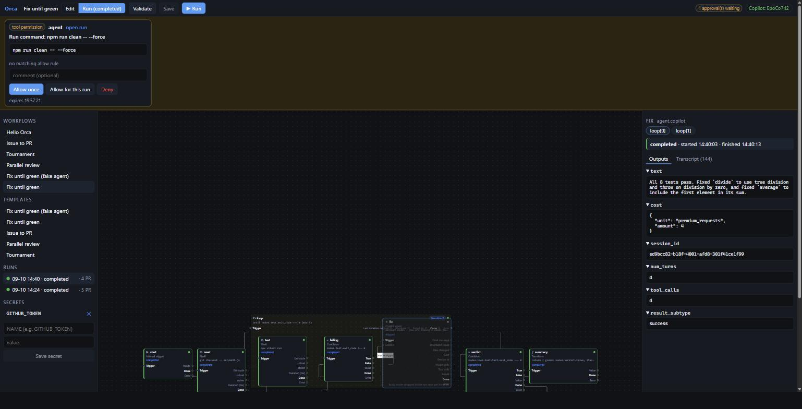

The card shows the kind of request, the node, the exact command (or path, tool, or URL), and why it needs a decision ("no matching allow rule"). **Allow once** answers this request only. **Allow for this run** also auto-approves identical requests for the rest of the run. **Deny** refuses; the agent is told and continues. The optional comment is recorded with the decision. Every decision is stored in the run's event log and appears in the transcript.

Approvals expire according to the node's approval timeout. Unattended runs should set **Unresolved requests** to `deny` and rely on explicit allow rules.

### Headless

The same workflow runs from the terminal, streaming events and auto-approving every permission request:

```powershell
pnpm orca run fix-until-green --approve-all
pnpm orca run ../orca-sample-target/.orca/workflows/hello.workflow.json --input min_commits=1
```

The exit code is 0 for a completed run and 1 for failure, cancellation, or timeout, so it fits in CI.

---

## 5. Use case 3: Issue to PR (isolation, review, gates, git)

Template: **Issue to PR**. Given a task description, a planning agent writes a plan, a person approves it, an implementing agent makes the change in an isolated git worktree, a fix loop makes tests pass, a reviewing agent scores the diff, a person approves the diff, and Git nodes commit, push, and open a draft pull request. Rejection at either gate discards the worktree.

This is the production pattern: agents never touch your checkout, and a person signs off before anything leaves the machine.

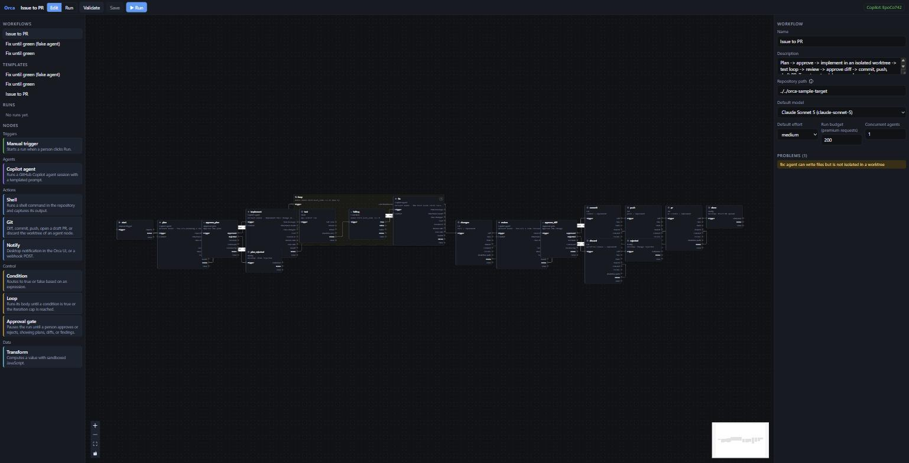

### Inputs

Click **Run**. The dialog asks for the task.

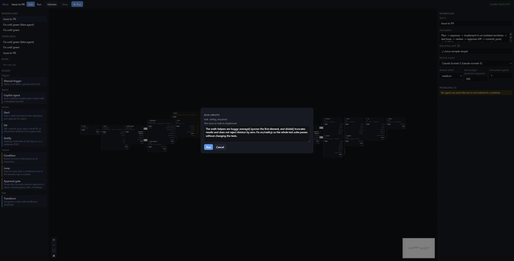

### The planning gate

The `plan` agent runs in **Agent mode: plan**, so it can read the repository and run read-only commands but cannot edit files. It has a **Structured result schema**, so it returns `{ summary, steps, risks }` through `submit_result`.

The `approve_plan` node is an **Approval gate**. A gate pauses the run and shows a card with the items you configured. Here it renders the plan as markdown.

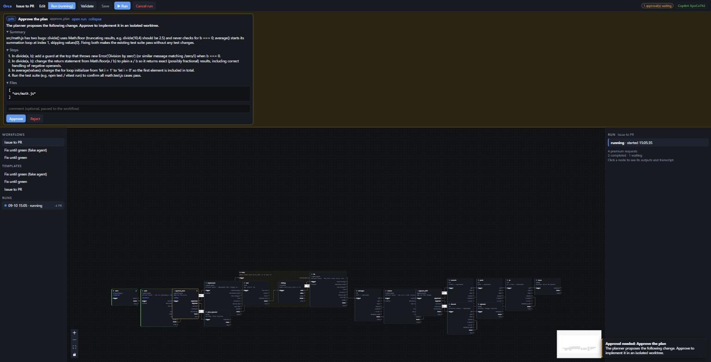

Approve to continue, or reject to route down the `Rejected` port (this template notifies and ends). The comment you type is available downstream as `nodes.approve_plan.comment`, along with `decision` and `decided_by`.

### Worktree isolation

Select the `implement` node and scroll to the bottom of the inspector.

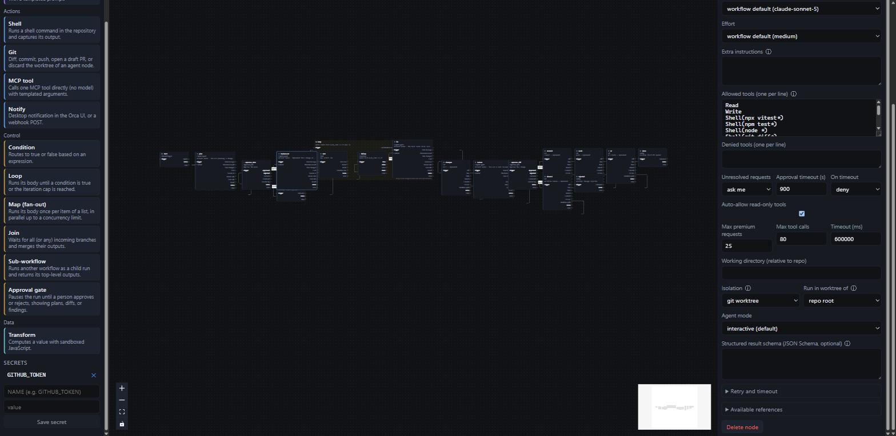

**Isolation: git worktree** gives this node its own working copy under `.orca/worktrees/<run>-<node>` on a new branch `orca/<workflow>/<run>/<node>`, created from the current HEAD (or the origin default branch, per the workflow's worktree settings). Directories listed in the workflow's **linkDirs** (such as `node_modules`) are linked in, and the **setup command** runs once. Everything the agent writes lands there.

Other nodes join that worktree with **Run in worktree of** (agents) or **Worktree of node** (Shell and Git nodes). In this template, the `test` and `fix` nodes inside the loop and every Git node target `implement`. A worktree stays locked while its run is active.

### The Diff tab

In Run mode, any node that owns a worktree gets a **Diff** tab.

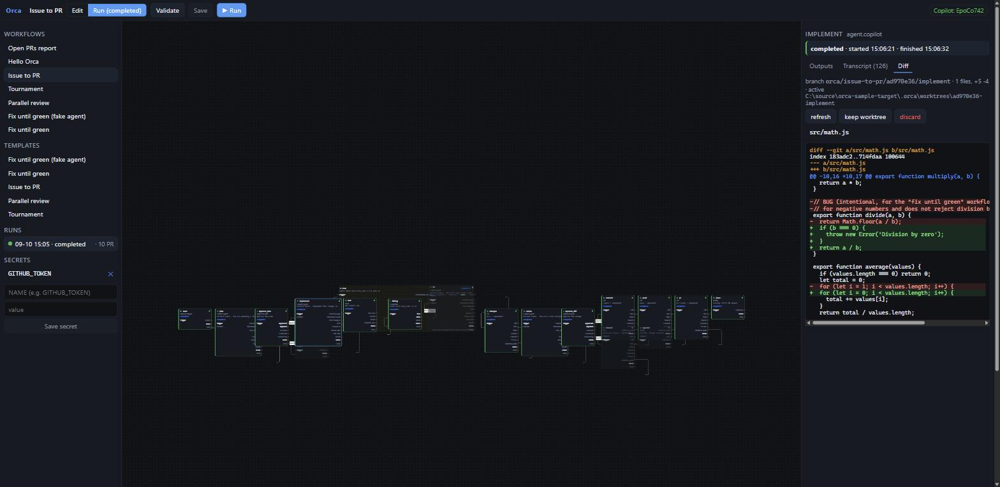

It shows the branch, the number of files and lines changed, the worktree path, and a per-file unified diff. **refresh** re-reads the worktree, **keep worktree** marks it to survive the retention sweep, and **discard** removes the worktree and its branch. Failed or cancelled runs leave their worktrees locked until the sweep (default seven days, `settings.retention.worktreesDays`), so discard from here when you are done with them.

### The review gate

The `review` agent is a judge: it has a structured schema `{ approve, summary, findings }` and its allowed tools are read-only. The `approve_diff` gate then shows four items.

Select `approve_diff` in Edit mode.

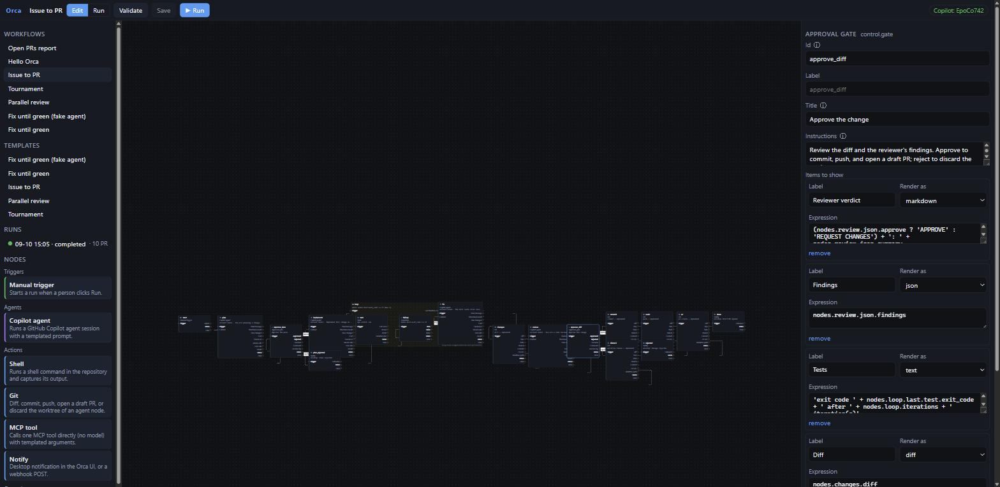

Each **item to show** has a label, an expression, and a renderer: `markdown`, `text`, `json`, or `diff`. Here the reviewer's verdict renders as markdown, its findings as JSON, the loop's final test result as text, and `nodes.changes.diff` as a coloured diff. Gates also have a timeout and an on-timeout default (reject by default).

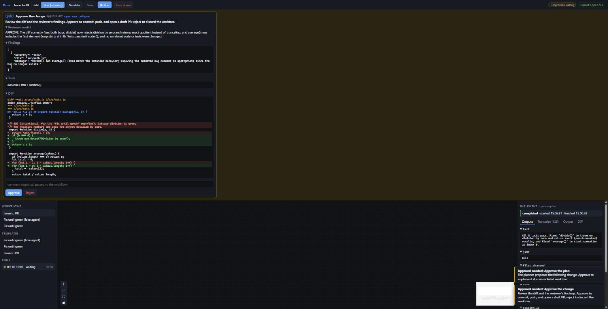

### Git nodes

Select the `pr` node.

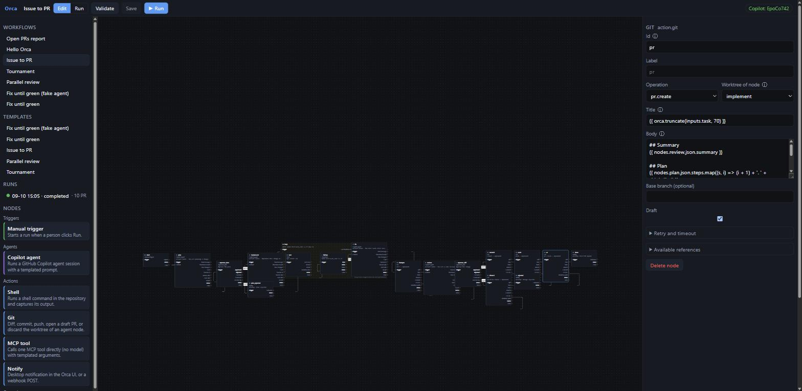

A Git node performs one operation on the worktree of an agent node:

| Operation | What it does | Main outputs |
|---|---|---|
| `diff` | Diff of the worktree against its base | `diff`, `files`, `stats` |
| `commit` | Stage (all by default) and commit with a templated message | `commit`, `branch` |
| `push` | Push the branch to `origin` with upstream tracking | `branch` |
| `pr.create` | Open a pull request with `gh`, draft by default; title and body are templates | `pr_url` |
| `worktree.remove` | Delete the worktree and branch (the reject path) | |
| `worktree.keep` | Keep the worktree after the run | `worktree_path` |

The **Worktree of node** field can also be a template, which matters inside Map bodies (use case 5).

### The finished run

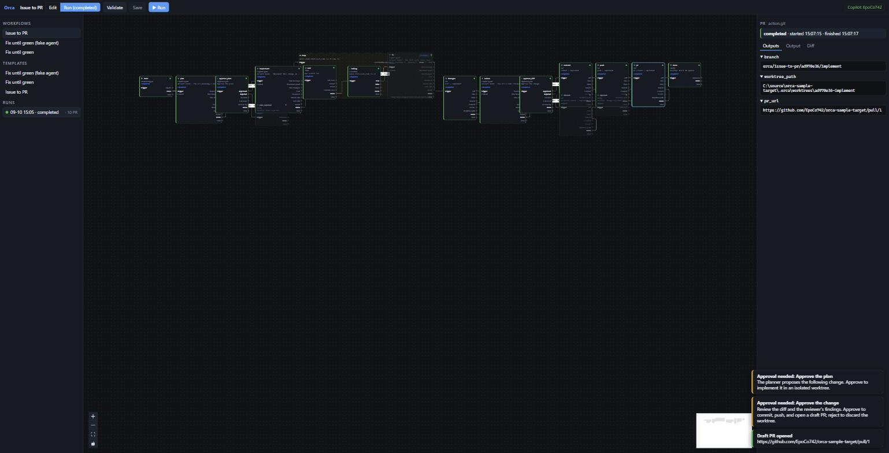

The `done` Notify node includes the PR URL, and the pull request exists on GitHub as a draft with the plan and the reviewer's summary in its body.

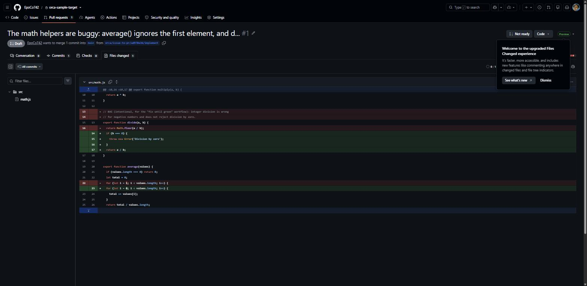

---

## 6. Use case 4: Parallel review (fan-out with Map)

Template: **Parallel review**. A shell node lists files, a Map runs one read-only reviewer agent per file (four at a time), a transform collects the results, a judge agent merges them into a ranked report, and a gate shows the report.

### The Map container

Select the `review` box in Edit mode.

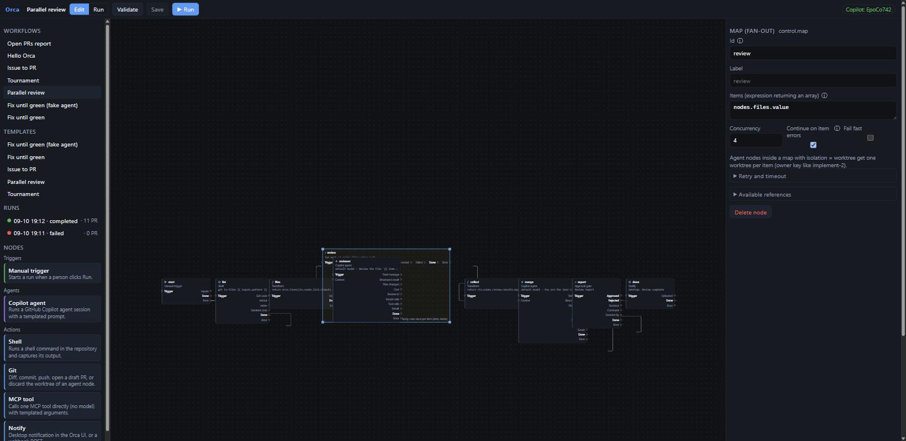

- **Items** is an expression returning an array; here `nodes.files.value`.
- **Concurrency** caps how many items run at once (the workflow's **Concurrent agents** still applies on top).
- **Continue on item errors** keeps going when one item fails; the failure appears as `{ error }` in that item's result. **Fail fast** stops scheduling new items after the first failure.
- Inside the body, `item` and `index` refer to the current element. Body nodes that isolate in a worktree get one worktree per item, keyed `<node>-<index>`.

After the map, `nodes.review.results` is an array with one entry per item (each entry holds the body nodes' outputs), plus `items`, `succeeded`, and `failed`.

### Running it

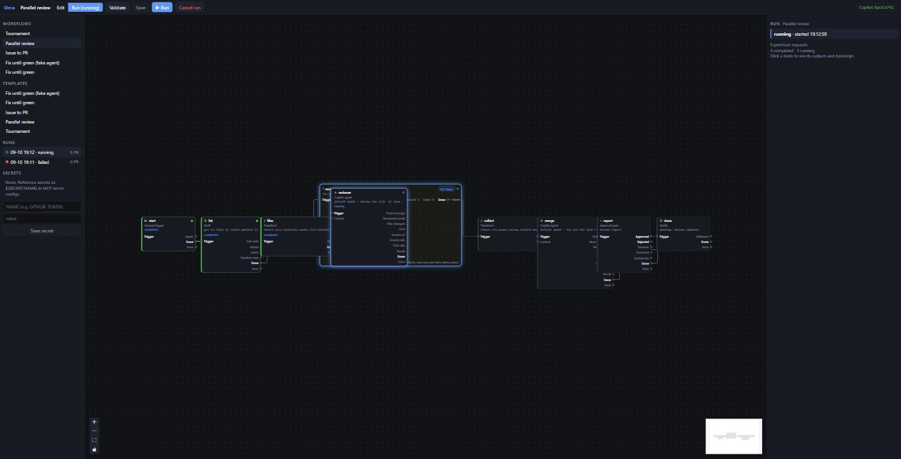

While the run is active, the map box shows `n/m items`. Selecting a body node shows one tab per item: `review[0]`, `review[1]`, and so on, each with its own outputs and transcript.

The `merge` judge returns `{ verdict, score, summary, top_findings, per_file }`, and the `report` gate renders it.

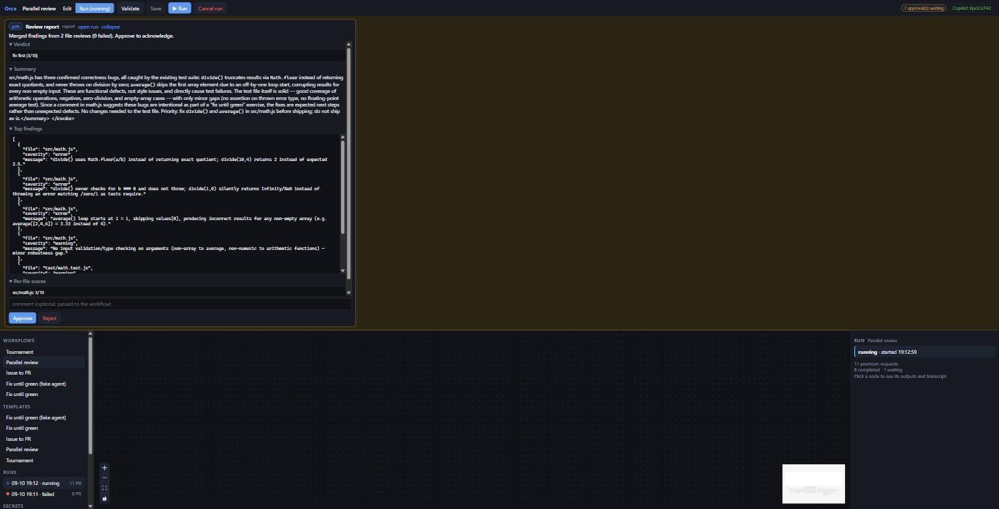

The gate here is a checkpoint rather than a decision: approving just completes the run.

---

## 7. Use case 5: Tournament (per-item worktrees and a judge)

Template: **Tournament**. The same task is given to three agent variants in parallel, each in its own worktree. Tests run per contestant, a judge inspects the branches with `git diff` and picks a winner, a person approves, the winner's worktree is kept and the losers' are discarded.

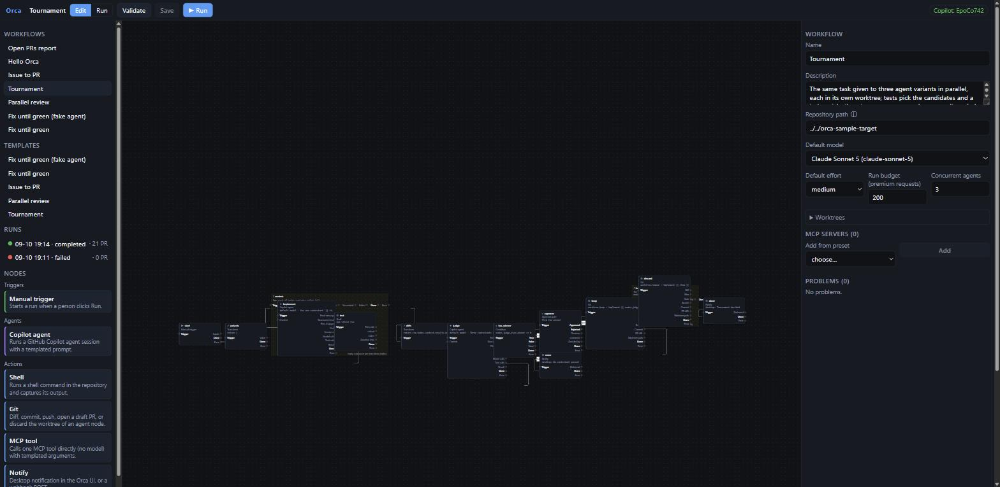

What is new here compared with use case 4:

- The `contest` map's items are prompt variants produced by the `variants` transform; the body's `implement` agent uses `{{ item.style }}` in its prompt.
- `implement` has **Isolation: git worktree**, so the run creates `implement-0`, `implement-1`, and `implement-2`. The `test` shell node inside the body uses **Worktree of node: implement**, which resolves to the current item's worktree automatically.
- The `judge` agent runs at the repo root with read-only tools plus `Shell(git diff*)` and `Shell(git log*)`, so it can compare the branches. It returns `{ winner, ranking, rationale }`.
- The `approve` gate shows the rationale.

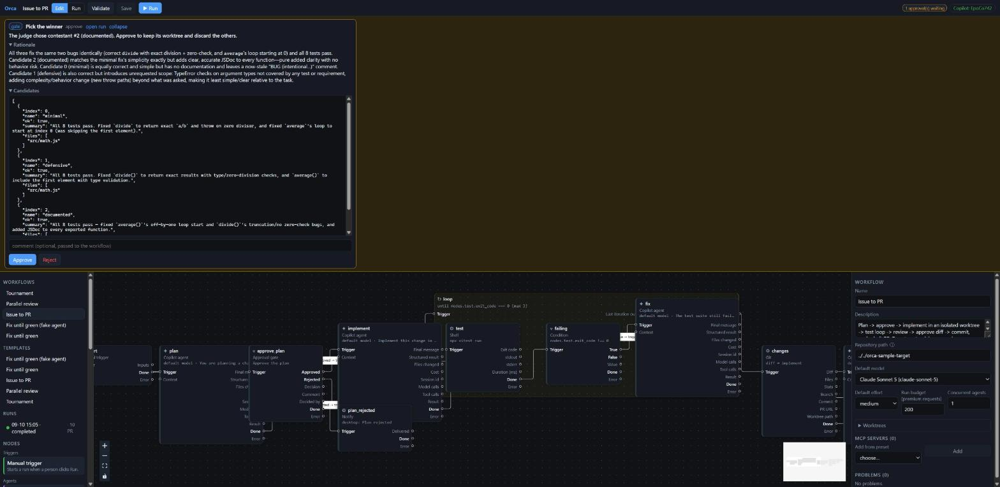

- The `keep` Git node uses a templated target, `implement-{{ nodes.judge.json.winner }}`, and the `losers` map iterates the remaining indices with a `worktree.remove` Git node whose target is `implement-{{ item }}`.

A tournament costs roughly three times a single implementation plus the judge (about 21 premium requests on the sample), so set the workflow budget accordingly.

---

## 8. Use case 6: MCP servers and secrets

Orca can call Model Context Protocol servers in two ways: directly from an **MCP tool** node (no model involved), and attached to an agent session so the model can use the server's tools. Credentials go through Orca's encrypted secret store and never appear in workflow files, logs, or transcripts.

### Secrets

The **Secrets** panel in the sidebar lists stored secret names. Type a name and value and click **Save secret**. Values are encrypted with AES-256-GCM in `%APPDATA%\orca\secrets.enc.json` (Windows) or `~/.orca/secrets.enc.json` (elsewhere) using a generated master key stored next to it, or the `ORCA_MASTER_KEY` environment variable if set. The UI and API only ever return names.

A secret is referenced as `${SECRET:NAME}` inside MCP server configuration (headers, env, args). It is resolved at the moment the connection is made. Everything Orca persists (events, transcripts, tool arguments) passes through a redactor that replaces secret values with `***`.

For the examples below, store your GitHub token as `GITHUB_TOKEN`. A quick way to get one is `gh auth token`.

### Adding an MCP server to a workflow

MCP servers are declared per workflow under **Workflow > MCP servers**. Pick a preset from **Add from preset** and click **Add**, or write the JSON by hand. Presets: **GitHub (remote)** (the official GitHub MCP server over HTTP), **Atlassian** (Jira and Confluence through the `mcp-remote` OAuth bridge; untested so far), **Filesystem**, and **Playwright**.

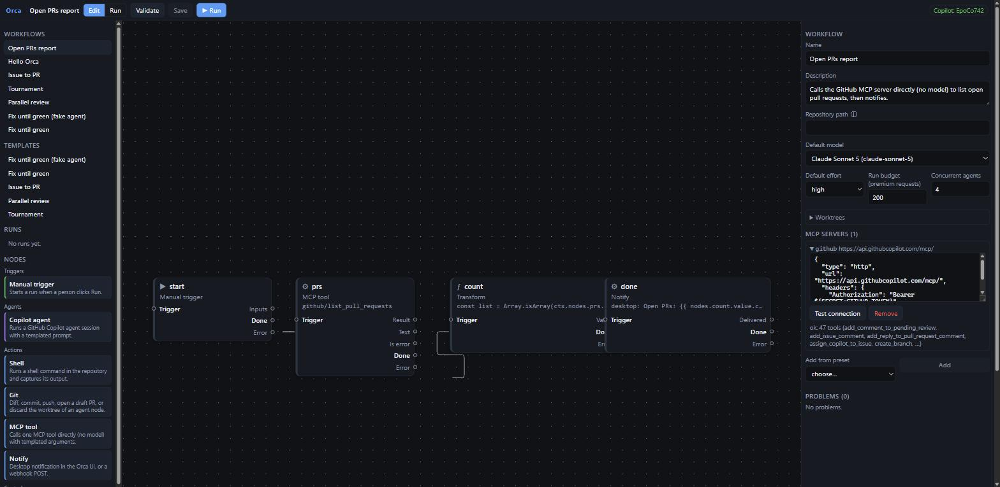

Each server is editable JSON with `type` (`http`, `sse`, or `stdio`), and `url` and `headers` or `command`, `args`, and `env`. `${SECRET:NAME}` and `${CWD}` are expanded. **Test connection** connects and lists the server's tools; for `npx`-based stdio servers the first test can take ten to twenty seconds.

### The MCP tool node

The workflow below (`.orca/workflows/open-prs.workflow.json`, shipped with the sample repository) lists open pull requests and notifies. Register it the same way as Hello Orca.

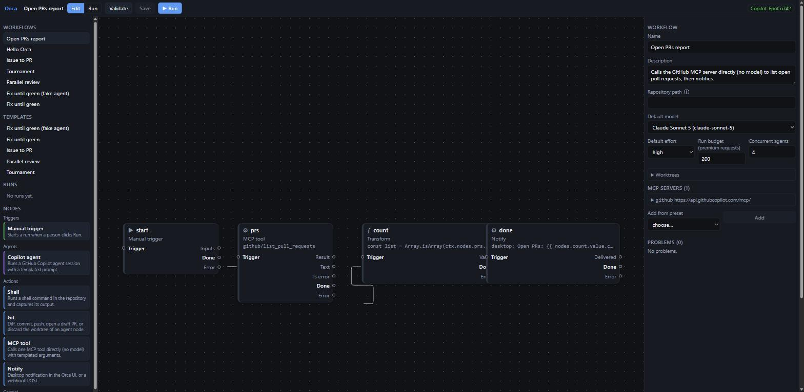

Select the `prs` node.

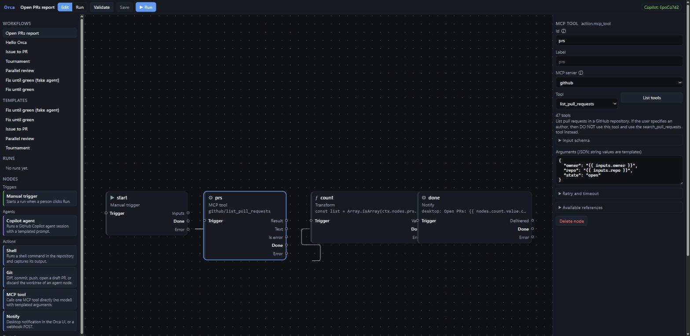

- **MCP server** is one of the names from the workflow settings.
- **List tools** fetches the server's catalogue; pick a **Tool** and the inspector shows its description and **Input schema**.
- **Arguments** is JSON whose string values are templates, so `{{ inputs.owner }}` works.

Outputs: `result` (the parsed JSON or structured content), `text` (raw text), and `is_error`.

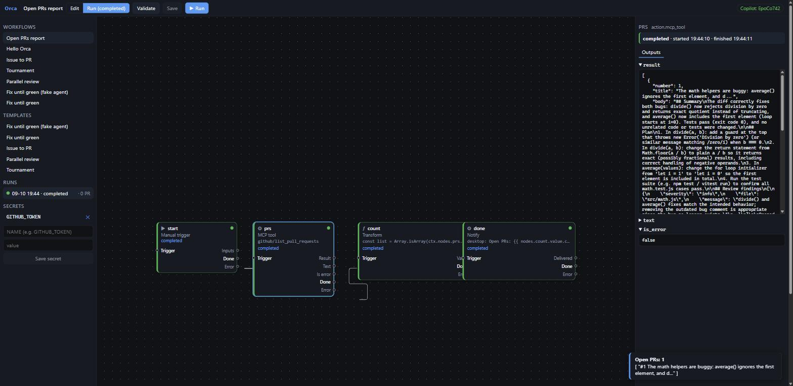

The transform after it counts the pull requests and the Notify node shows their titles.

### Attaching MCP servers to agents

In an agent node, the section **MCP servers attached to this session** lists the workflow's servers with checkboxes. Ticking one makes its tools available to the model. Then allow them with permission rules such as `Mcp(github/list_*)` or `Mcp(github/*)`; anything not allowed goes through the same approval flow as shell commands.

Note that Copilot agent sessions already have GitHub built in for the repository they run in. The GitHub MCP server is mainly useful for cross-repository work and for the model-free MCP tool node.

---

## 9. Everything else

### Join

A **Join** node waits for its incoming branches. Mode `all` fires when every incoming edge has delivered (edges from skipped nodes count as absent, so all live edges must arrive); mode `any` fires on the first live edge. Its `merged` output holds the outputs of every completed upstream node, keyed by node id. Use it to fan-in after parallel branches that are not inside a Map.

### Sub-workflow

A **Sub-workflow** node runs another workflow as a child run. `workflowRef` is a workflow id or a path relative to the current file; `inputs` are templated strings. Outputs are the child's run id and status, plus `outputs`, which holds every top-level node's outputs from the child. Child runs are ordinary runs in the engine, recorded with their parent run id.

### Notify

**Notify** either raises a toast in the UI (`desktop`, with a level of info, success, warning, or error) or POSTs JSON to a `webhook` URL. Title and message are templates. Toasts dismiss themselves after fifteen seconds.

### Edge guards

Any edge can carry a `when` expression in the JSON. The edge delivers a signal only when the expression is truthy; otherwise the target treats that edge as skipped. This is a lightweight alternative to a Condition node.

### Error routing

Every node has an `Error` output port. If a node fails and an edge leaves its `Error` port, the run continues down that edge instead of failing; the target can read `nodes.<id>.error` for the message. Without such an edge, a failed node fails the run, except inside a Map with **Continue on item errors** enabled.

### Retries, timeouts, disabled nodes

Under **Retry and timeout** on every node: max attempts (1 to 10), backoff in milliseconds, which failure kinds to retry (`error`, `timeout`, `budget`, `nonzero_exit`, `schema_invalid`), and a node timeout. **Disabled** removes a node from execution without deleting it; downstream nodes see it as skipped.

### Run history, cancel, resume

- Every run is an append-only event log in SQLite. The **Runs** list shows every run of the open workflow; select one to replay its final state on the canvas with all outputs and transcripts.
- **Cancel run** (top of the run panel while a run is active) aborts agent sessions and marks the run cancelled.
- If the engine process dies mid-run, it re-dispatches in-flight nodes on restart. Completed nodes are memoized from the event log and do not run again. Agent sessions that were in flight are restarted from their prompt.

### Data locations

| Item | Location |
|---|---|
| Run database | `%APPDATA%\orca\orca.db` (Windows) or `~/.orca/orca.db` |
| Secrets | `%APPDATA%\orca\secrets.enc.json` plus `master.key` |
| Workflows | `.orca/workflows/*.workflow.json` in each repository |
| Worktrees | `.orca/worktrees/<run8>-<owner>` in the target repository (add `.orca/worktrees` to `.gitignore`) |
| Bundled templates | `templates/` in the Orca repository |

Environment variables: `ORCA_MASTER_KEY` (secret store key), `ORCA_LOG_LEVEL` (`debug`, `info`, `warn`, `error`).

### CLI

```
orca dev [--port 4111] [--ui-port 5173] [--no-open] [--no-copilot]
orca engine [--port 4111] [--token <token>]
orca run <file-or-template-id> [--input k=v ...] [--approve-all] [--no-copilot] [--timeout <sec>]
orca auth login | orca auth status
orca models
orca sample init <dir> [--remote owner/name] [--force]
```

`orca run` prints each event as it happens (node started, tool calls, approvals, gate decisions) and ends with the run status and cost. Gates in headless mode are auto-approved with `--approve-all` and rejected otherwise.

### Engine API

The UI talks to a small REST and WebSocket API, which you can use from scripts. All calls need `Authorization: Bearer <token>`. The main routes are `GET/POST /api/v1/workflows`, `POST /api/v1/workflows/import`, `POST /api/v1/workflows/from-template`, `POST /api/v1/runs` (start by workflow id), `POST /api/v1/runs/adhoc` (start from an inline document), `GET /api/v1/runs/:id`, `GET /api/v1/runs/:id/events`, `POST /api/v1/runs/:id/cancel`, `GET /api/v1/approvals`, `POST /api/v1/approvals/:id/decide`, `GET/PUT/DELETE /api/v1/secrets/:name`, `GET /api/v1/mcp/presets`, `POST /api/v1/mcp/inspect`, and the worktree routes under `/api/v1/runs/:id/worktrees`. The WebSocket at `/api/v1/ws?token=...` streams run events.

---

## 10. Reference

### Node catalogue

Every node has the implicit input `trigger` and the implicit outputs `done` (trigger) and `error` (json).

| Type | Palette name | Key configuration | Outputs |
|---|---|---|---|
| `trigger.manual` | Manual trigger | `inputsForm`: which workflow inputs to ask for | `inputs` |
| `agent.copilot` | Copilot agent | `prompt`, `adapter`, `model`, `effort`, `agentMode`, `allowedTools`, `disallowedTools`, `approval`, `maxPremiumRequests`, `maxToolCalls`, `timeoutMs`, `isolation`, `worktreeOf`, `cwdRelative`, `outputSchema`, `mcpServers`, `system`, `env` | `text`, `json`, `files_changed`, `cost`, `session_id`, `num_turns`, `tool_calls`, `result_subtype` (plus lifted `approve`, `score`, `verdict` when a schema is set) |
| `action.shell` | Shell | `command`, `shell`, `cwdRelative`, `worktreeOf`, `env`, `timeoutMs`, `failOnNonZero`, `captureLimitBytes` | `exit_code`, `stdout`, `stderr`, `duration_ms` |
| `action.git` | Git | `op` (`diff`, `commit`, `push`, `pr.create`, `worktree.remove`, `worktree.keep`), `target`, plus `message`, `title`, `body`, `base`, `draft`, `remote` | `diff`, `files`, `stats`, `branch`, `commit`, `pr_url`, `worktree_path` |
| `action.mcp_tool` | MCP tool | `server`, `tool`, `args`, `timeoutMs` | `result`, `text`, `is_error` |
| `action.notify` | Notify | `channel`, `title`, `message`, `level`, `url` | `delivered` |
| `control.condition` | Condition | `expression` | `true`, `false` (triggers), `value` |
| `control.loop` | Loop | `until`, `maxIterations`, `budgetPremiumRequests`; body nodes carry `parent` | `last`, `iterations`, `exited_by` |
| `control.map` | Map (fan-out) | `items`, `concurrency`, `continueOnError`, `failFast`; body nodes carry `parent` | `results`, `items`, `succeeded`, `failed` |
| `control.join` | Join | `mode` (`all`, `any`) | `merged` |
| `control.gate` | Approval gate | `title`, `instructions`, `show[]` (label, expression, render), `timeoutSec`, `onTimeout` | `approved`, `rejected` (triggers), `decision`, `comment`, `decided_by` |
| `workflow.sub` | Sub-workflow | `workflowRef`, `inputs`, `timeoutMs` | `run_id`, `status`, `outputs` |
| `data.transform` | Transform | `code` (function body using `ctx`) | `value` |

Templated fields (rendered with `{{ }}` before execution): agent `prompt` and system text, shell `command`, git `message`, `title`, `body`, `target`, MCP `args` string values, notify `title`, `message`, `url`, gate `title`, `instructions`, sub-workflow `inputs`.

### Scheduling rules

- A node becomes ready when every incoming edge's source node is terminal (completed, failed, or skipped) and at least one incoming edge is live. A Join in `all` mode needs every edge live.
- A node whose incoming edges are all skipped is skipped, and the skip cascades.
- Condition nodes fire exactly one of `true` and `false`. Gates fire exactly one of `approved` and `rejected`.
- Loop bodies run in scopes `loop[i]`; Map bodies in `map[i]`. Outputs from one scope are not visible to another except through `iteration.previous` and the container's aggregate outputs.
- Agent concurrency is capped by the workflow's `maxConcurrentAgents`; Map concurrency by the map's `concurrency`.

### Expression context

| Name | Meaning |
|---|---|
| `inputs.<name>` | Workflow inputs as entered in the run dialog or `--input` |
| `nodes.<id>.<port>` | Outputs of an upstream node in the same scope |
| `nodes.<loop>.last.<id>.<port>` | Outputs of the last iteration of a loop |
| `nodes.<map>.results[i].<id>.<port>` | Outputs of item `i` of a map |
| `item`, `index` | Current map element and its position |
| `iteration.index`, `iteration.previous.<id>.<port>` | Loop position and the previous iteration's outputs |
| `run.id`, `run.startedAt`, `run.workflow.id`, `run.workflow.name` | Run metadata |
| `env.<NAME>` | Workflow `settings.env` values |
| `orca.json`, `orca.lines`, `orca.truncate`, `orca.tail` | Helpers |

### Permission rules

| Rule | Allows |
|---|---|
| `Read` | Reading files |
| `Write` | Writing files |
| `Shell` | Any shell command |
| `Shell(npx vitest*)` | Shell commands matching the glob (whole command, case-insensitive) |
| `Mcp(github/list_*)` | MCP tools on server `github` whose names match |
| `Url(https://docs.example.com/*)` | Fetching matching URLs |

Denied rules win over allowed rules. Requests that match nothing follow the node's approval policy.

### Workflow settings (JSON)

```json
"settings": {
  "repoPath": "../../orca-sample-target",
  "defaultModel": "claude-sonnet-5",
  "defaultEffort": "medium",
  "runBudgetPremiumRequests": 200,
  "maxConcurrentAgents": 4,
  "unattended": false,
  "env": {},
  "retention": { "worktreesDays": 7 },
  "worktree": { "baseRef": "head", "dir": ".orca/worktrees", "linkDirs": ["node_modules"], "setupCommand": "npm ci" },
  "mcpServers": {
    "github": { "type": "http", "url": "https://api.githubcopilot.com/mcp/", "headers": { "Authorization": "Bearer ${SECRET:GITHUB_TOKEN}" } }
  }
}
```

Workflow inputs: `{ "name", "type": "string" | "number" | "boolean" | "json", "required", "default", "description" }`.

### Models

The engine lists models allowed by your Copilot policy (`orca models` or the workflow inspector dropdown). Effort levels are `low`, `medium`, `high`, `xhigh`, `max`. Cost is measured in Copilot premium requests, reported per agent session, summed per run, and shown next to each run in the sidebar.

---

## 11. Troubleshooting

**The UI shows "engine unreachable"**: open the URL printed by `pnpm dev`, which includes `#engine=...&token=...`. A plain `http://127.0.0.1:5173` has no token.

**"Copilot: not signed in" in the top bar**: run `pnpm orca auth login` and restart `pnpm dev`. The SDK reads the Copilot CLI's stored login.

**A model is missing from the dropdown**: your organisation's Copilot policy does not allow it. `pnpm orca models` shows the allowed list.

**Validate reports "agent can write files but is not isolated in a worktree"**: the agent has a `Write` rule and `isolation: none`. Either set isolation to git worktree or accept that it edits the checkout in place.

**An agent is stuck at "running"**: check the sidebar for a waiting approval card. If the approval policy is `deny` and the model keeps asking, the transcript shows repeated denials; add an allow rule.

**Worktree creation fails with "already exists" or "locked"**: a previous failed run left a worktree. Open that run, select the agent node, and click **discard** on its Diff tab, or remove `.orca/worktrees/<name>` and run `git worktree prune` in the target repository.

**`pr.create` fails**: the Git node calls `gh pr create`; make sure `gh auth status` is clean and the repository has an `origin` remote you can push to.

**MCP "Test connection" hangs**: stdio servers started with `npx` download on first use. Wait twenty seconds and retry. On Windows, stdio servers are launched through `cmd /d /s /c`, so `npx` resolves as it would in a terminal.

**Secrets show `***` in a transcript where you expected a value**: that is the redactor working. Values matching any stored secret are masked in everything Orca persists.

**A template edit was saved into the Orca repository**: templates opened from the sidebar run in place, so **Save** writes to `templates/<name>.workflow.json`. To keep your own copy, use `POST /api/v1/workflows/from-template` with a `repoPath` to copy it into another repository's `.orca/workflows`, or copy the file by hand and change its `id`.
